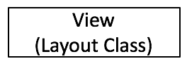
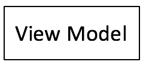
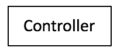
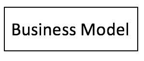
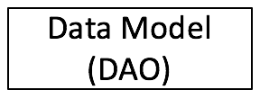
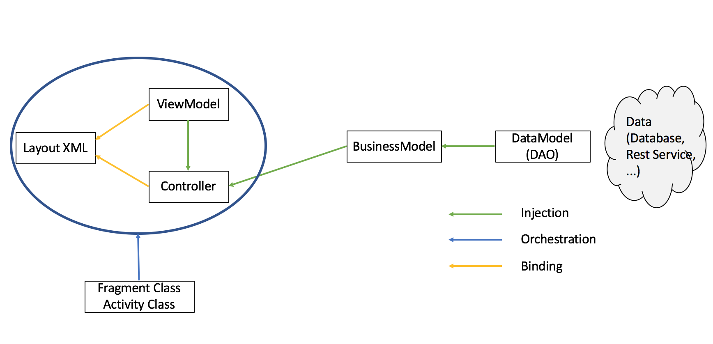
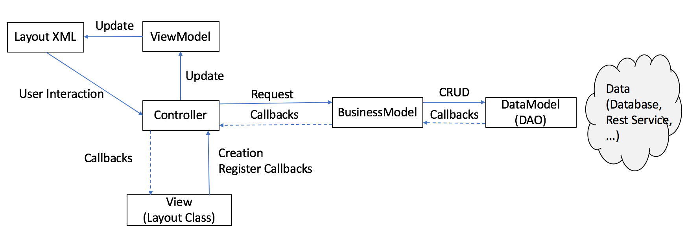

# MVVM Sample
This is a MVVM Sample project with different frameworks and a full stack android app.

It is calling the [HubbleSite.org](http://hubblesite.org/) API and is creating a List with the latest 25 news headlines and loading an image to each news item.

Frameworks and there responsibility
* [Dagger 2](https://google.github.io/dagger/): Dependency Injection, swap classes for testing and support a well design app structure
* [Retrofit](http://square.github.io/retrofit/): Calling the API Service and transform them to Entities. It is also used to mock network requests and simulate network behavior
* [RxAndroid2](https://github.com/ReactiveX/RxAndroid): In this project it is only to handle the API Responses asynchroniuslly
* [Data Binding](https://developer.android.com/topic/libraries/data-binding/index.html): Binding of the ViewModel to the XML layout file.
* Unit tests with [Robolectric](http://robolectric.org/): Robolectric to mock the Android System and get the context.
* Instrumental tests with [Espresso](https://developer.android.com/training/testing/espresso/index.html): Running UI / Instrumental tests

Mocking in UI tests is done by implementing an extention of the services and integrate them via Dagger 2

## Purpose
The purpose of this small android app is to provide a relatively easy to understand MVVM pattern app,
maybe as starting point for beginners or as discussion basis for advanced developers
but with the state of the art libraries. It will be well documented (in the near future).

This project will be an active project that will be updated on investigation better approches.

Feedback, discussion and pull requests will be very welcome!

It will focus on architectural design not on ui.

---
**Why MVVM patter?**

If we use dependency injection to inject POJOs into Android related classes (and others) it is so easy to
separate Android from plain Java. That makes it very easy to test. You can just create the POJOs ( ViewModel,
ViewController, BusinessModell, ServiceImplementation), wire them up and test them. This way you can test the
business, the state of the view and even user interactions like a button click.

It makes it easy to run TDD. E. g. you can mock the service and inject it into your DAO or DataModel (how ever you call it).
Create the controller and inject the DAO and the ViewModel. There you are. Now you can create test with a mocked input and test
the outcome on the ViewModel. If you only use constructor injection you even do not need Dagger 2 for the injection, you can
do this in the @Before method.

With a mocking framework you do not even need to inject objects via dagger. Maybe this will be taken into account later.

## Responsibility

First of all, the responsibilities of the different components.

**View**

Type: Activity class | Fragment class

 //neues Bild
 * Orchestrate the view model, controller and Layout by:
     * Creating the controller (maybe by dependency injection)
     * Register Callbacks
 * Handle Activity or Fragment Changes (E.g. put another Fragment to the stack)

---
**View Model**

Type: POJO

* Holding the state of the View
* Execute simple view logic

* Bind to the XML Layout file
------------------------------
**Controller**

Type: POJO

* Create View Model
* Update View Model
* Request Business Model
* Notify Fragment | Aktivity | Parent Controller via Callbacks
* Bound to XML Layout file

---
**Business Model**

Type: POJO

* Implement use cases
* CRUD operations on data via Data Model

---
**Data Model (DAO)**

Type: POJO

* Access to the data layer (e. g. retrofit, database)

### Wire it all up

The **Fragment class | Activity class** will wire the view elements. It have to call
inflate() from the Binding class or call the DataBindingUtility to get an instance
of the generated Binding class.

It will also create the Controller that holds the ViewModel. The ViewModel will be
injected via constructor injection, thus in tests it will be created by the test
otherwise it can be created via Dagger 2.

The Fragment class | Activity class will set the ViewModel and the Controller
to the Binding object

At least, it has to register its Callbacks at the Controller to handel Fragment | Activity
changes.

The **BusinessModell** will be injected into the Controller.

The **DataModel (or DAO)** will be injected into the BusinessModel. It
holds an instance of a network manager that will provide the services.
For testing, this network manager can be swapped to a mocked network
manager that hold mock services.

## Data Flow

Everything that relates to business logic will be done asynchroniously
with *reactive.io*. The **DAO** provides the Entities encapsulated in
Observable or Single Objects. This could be a simple delegation from a
RESTfull service or a transformed and prepared Entity or Entity list.
(this could be the use of a JSON deserializer to set some properties the
right way)

The controller will take the responses from the BusinessModel, may do some
transformations and update the ViewModel. The ViewModel is bound to the
layout file and update via databinding.Observables.

User inputs like click listener will be bound to the Controller. Thus,
user input will be handled by the controller. It may request the BusinessModel
and on response update the ViewModel. So there is a one-way data flow
in the the view cycle.

## Custom Views

CustomViews can have the same live cycle as Fragments or Activities.
To update only the CustomView they can handle the everything them self.
To update the whole View, they delegate the call to the parent Controller
and let it do the calls to the BusinessModel.

* Controller creates and holds the CustomController (CustomController hold the CustomViewModel)
* Controller updates the ViewModel with the CustomController databinding.Observable
* Through binding the ViewModel will set the CustomController and CustomViewModel to the
CustomView
* The CustomController holds a reference to the Controller to delegate
calls that regards to the whole view (parent controller).
User interactions that will only
 update the CustomView the CustomController can handle itself by calling
 the BusinessModel and update the CustomViewModel on response.

